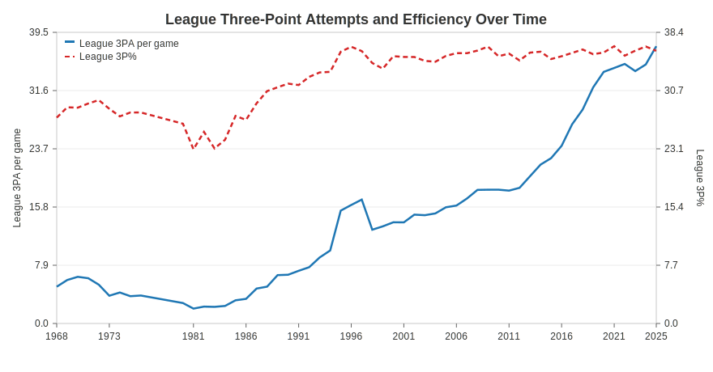
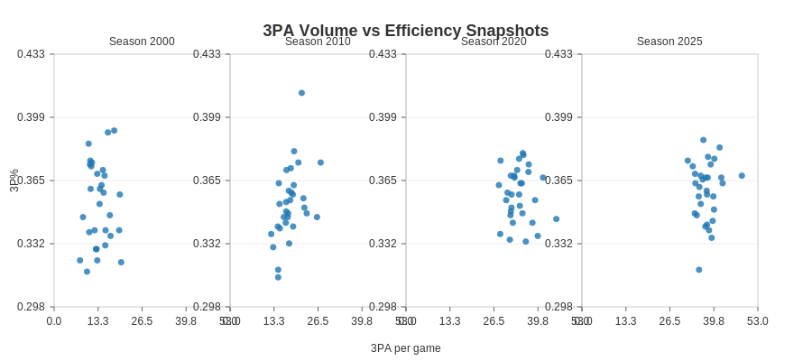
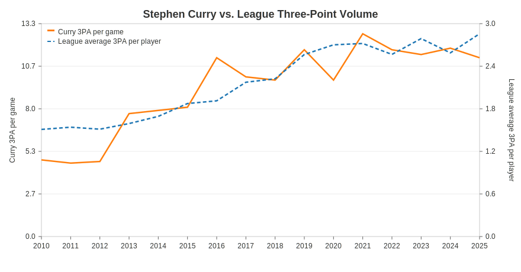
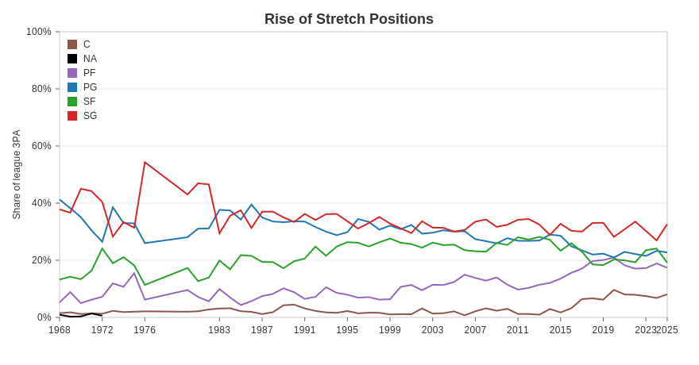
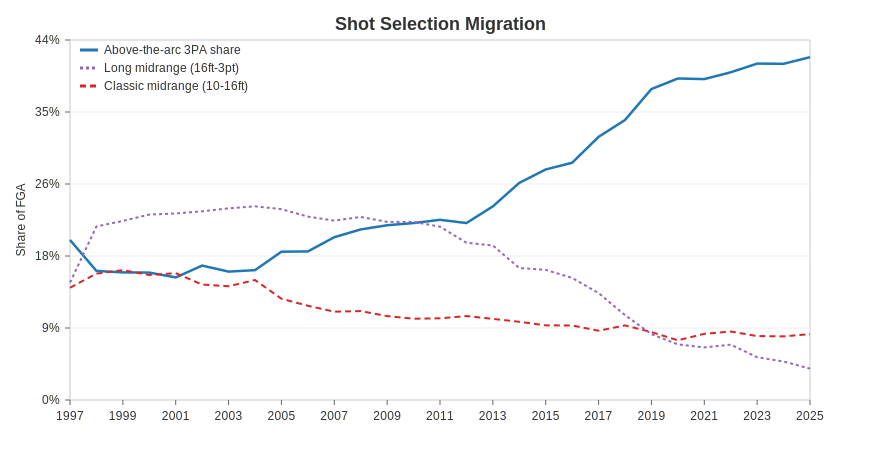

# Designing the NBA 3-Point Revolution Story

**Team Members:** _Add full roster here_  
**Course / Section:** _Add section_  
**Submission Date:** _Add date_  
**Primary Purpose:** Presentation-first scrollytelling experience that can be repurposed for class talks and broadcast segments.

---

## 1. Problem & Motivation

The NBA has undergone one of the steepest strategic pivots in modern sports. The three-point shot evolved from experiment to the engine of league-wide offense, yet the shift spans decades, rule changes, roster construction, and the singular influence of Stephen Curry. Our visualization aims to:

- Reconstruct the timeline of the league’s three-point evolution with data-driven evidence.
- Highlight Curry and the Golden State Warriors as catalysts that accelerated the transition into the modern perimeter-first era.
- Connect tactical changes (shot selection, roles, pace, adoption timing) to on-court success metrics (efficiency, net rating, wins).

Why the visualization matters:

- **Presentation strength:** distills millions of rows of play, shot, and season stats into a compelling storyline for audiences with mixed data literacy.
- **Analytical depth:** retains interactive hooks so analysts, journalists, and coaches can explore outliers, test hypotheses, and export supporting views.
- **Pedagogical value:** demonstrates how a single strategic innovation reshapes personnel decisions, salary value, and fan experience.

---

## 2. Target Audience & Use Cases

- **Primary:** classmates and instructors expecting a cohesive narrative with annotated visuals they can interpret quickly.
- **Secondary:** basketball fans and media members seeking memorable artifacts (e.g., shot profile flips, Curry vs. league context) for storytelling.
- **Tertiary:** analysts and coaches who want to benchmark when teams embraced the perimeter game and how it translated into efficiency.

Design implications:

- Favor bold annotations and progressive disclosure rather than dense dashboards.
- Provide “export-ready” graphics and textual capsules to support speeches or articles.
- Offer optional tooltips/filters for power users without overwhelming casual viewers.

---

## 3. Data Inventory & Characteristics

All files live locally in `NBA 1st dataset/` and trace back to Basketball-Reference (public) extracts via Kaggle. We verified initial coverage and row counts below:

| Dataset | Rows (excl. header) | Key Attributes | Notes |
| --- | --- | --- | --- |
| `Team Stats Per Game.csv` | 1,876 | Season, team, 3PA per game, 3P%, pace, points | Core for leaguewide volume & efficiency trends (1947–2025). |
| `Team Summaries.csv` | 1,876 | Wins, losses, net rating, 3P attempt rate, strength of schedule | Links strategy adoption to success metrics. |
| `Player Totals.csv` | 32,606 | Position, total 3PA, 3P%, assists, rebounds | Enables positional share analysis and volume distribution. |
| `Player Per Game.csv` | 32,606 | 3PA per game, 3P%, usage | Used for player narratives (e.g., Stephen Curry). |
| `Player Shooting.csv` | 17,521 | Shot distance, % of attempts by zone, dunk/corner rates | Supplies spatial trends and shot profile migration. |

Data types:

- **Numeric:** attempts, percentages, net ratings, shot coordinates/distances.
- **Categorical:** seasons, players, teams, positions, playoffs flag.
- **Temporal:** season (integer), experience, adoption years.
- **Spatial proxies:** shot zones and average attempt distance.

Data readiness:

- Minimal missingness; `Player Shooting` has `NA` for players lacking zone data (we drop these rows in averages).
- Files align on shared keys (`season`, `team`, `player_id`), supporting future joins (e.g., connecting shots + salaries once the salary table is added).
- Some combo positions (e.g., "SF-PF") are normalized to primary position for share calculations—documented in analysis scripts.

---

## 4. Exploratory Findings & Supporting Graphics

We generated early visuals directly from the provided CSVs (SVG prototypes saved under `figures/`). Each figure doubles as evidence that the data supports our proposed narrative.

### 4.1 League Adoption Accelerates

- League-average three-point attempts per game climbed from **2.8 (1980)** to **37.6 (2025)**, while accuracy rose from **26% → 36%**.
- The two curves in Figure 1 show volume exploding after 2013, with efficiency staying resilient.

### 4.2 Volume vs. Efficiency Snapshots

- Scatter panels for 2000, 2010, 2020, and 2025 highlight the rightward drift (volume) and slight upward shift (efficiency).
- 2000 teams cluster under 20 attempts; by 2025, most franchises live above 35 attempts with league-wide parity near 36% accuracy.

### 4.3 Stephen Curry vs. the League

- Curry’s per-game attempts outpaced the average player by **3–10 attempts** every season since 2010.
- His 2016 peak shows an unprecedented **+9.3 attempts** gap over the league average, matching the Warriors’ offensive explosion.

### 4.4 Positions Rewritten

- Frontcourt players (PF/C) accounted for **only 8.7%** of league threes in 1997; that share reached **25.5%** in 2025.
- Guard dominance is softening, reinforcing the “stretch big” storyline we plan to spotlight.

### 4.5 Shot Selection Migration

- Three-point shot share doubled from **~20% → 42%** across the sample window.
- Long midrange attempts plunged from **23%** (mid-2000s) to **3.8%** in 2025, visually confirming the death of the 18-foot jumper.

### 4.6 Team Adoption Timing

- We flag the first seasons teams crossed a **40% three-point attempt rate**.
- Early adopters were the 2017 Rockets (+5.7 net rating) and 2019 Bucks (+8.6), connecting perimeter commitment with winning.

---

## 5. Core User Questions & Tasks

1. **When did the league’s perimeter revolution inflect?**  
   Explore the annotated league timeline, filter by era, and correlate 3PA spikes with rule changes.

2. **Is higher volume matched by efficiency gains?**  
   Compare decadal scatter panels, toggle trend lines, and surface outlier teams that bucked the trend.

3. **How singular is Stephen Curry’s impact?**  
   Switch between star guards, hover to see season deltas vs. league averages, and export highlight cards.

4. **How did shot geography and positions evolve?**  
   View era splits (pre-2010 vs. post-2015), inspect positional share charts, and observe the spatial heatmaps we plan to add.

5. **Does early adoption translate to success?**  
   Sort teams by adoption year, brush across seasons, and read net rating differentials in context.

These tasks map to both **presentation** (guided scrollytelling with highlighted insights) and **analysis** (lightweight filters/tooltips for deeper dives).

---

## 6. Story Outline & Visual Design Concepts

We plan a scrollytelling layout with four major “chapters.” Each chapter pairs a hero visualization with supporting callouts and optional interactivity.

1. **Setting the Baseline (1979–2009)**  
   - Visual: multi-line timeline (Figure 1) with rule change annotations (3-point introduction, hand-check ban, pace-of-play initiatives).  
   - Goal: show slow build-up and set expectations for the explosion to come.

2. **Spark of a Revolution (2010–2016)**  
   - Visual: Curry vs. league panel (Figure 3) plus inset of Warriors’ shot chart (planned).  
   - Narrative: detail how one player/team rewrote shot selection and spacing, backed by data deltas.

3. **League-Wide Cascades (2016–2020)**  
   - Visuals: volume/efficiency scatter (Figure 2) and positional share chart (Figure 4).  
   - Interaction: filter by conference, highlight pace-adjusted attempts, show positional changes via story text.

4. **The New Normal (2020–Present)**  
   - Visuals: shot profile migration (Figure 5) and team adoption timeline (Figure 6).  
   - Close with key takeaways (e.g., disappearance of midrange, bigs as shooters, early adopters winning the net rating battle).

Planned presentation flow: vertical scrolling narrative with stepper navigation, each step auto-highlights relevant figure, and a persistent data glossary panel clarifies metrics.

---

## 7. Interaction Model & UX Notes

- **Filters & Highlights:**  
  Era selector (pre-2010, 2010–2016, post-2016), conference toggle, “highlight my team/player” search.

- **Tooltips & Context Cards:**  
  Hover states reveal raw stats, difference from league average, and contextual notes (e.g., 2014 hand-check rule).

- **Export & Share:**  
  Quick export buttons for PNG/SVG snapshots and auto-generated captions for slides or social coverage.

- **Accessibility:**  
  High-contrast color palette (tested in prototypes), textual annotations on key peaks, and keyboard navigable story steps.

---

## 8. Implementation Plan & Next Steps

Short-term milestones:

- Integrate salary table (pending local copy) to analyze pay vs. three-point value, expanding Chapter 4.
- Extend scripts to generate positional heatmaps once shot coordinate data is ingested.
- Build a lightweight prototype (Observable or React + D3) to test scrollytelling transitions with classmates.

Risks & mitigations:

- **Data Gaps:** Salary CSV is not yet present—flagged for ingestion; fallback is referencing external source if permissions allow.
- **Performance:** Five million shot records will require pre-aggregation for browser delivery; we will compute era summaries server-side.
- **Story Scope Creep:** We will prioritize the four chapters above and treat ancillary analyses (e.g., G-League influence) as stretch goals.

---

## 9. Appendix – Reproducibility Notes

- All exploratory scripts live in `analysis/` with generated figures in `figures/`.
- `analysis/make_charts.py` uses pure-Python SVG generation to avoid broken pandas/numpy bindings in the current environment.
- Future work will migrate these calculations into notebooks or a data pipeline for easier iteration once libraries are available.

_End of document._
